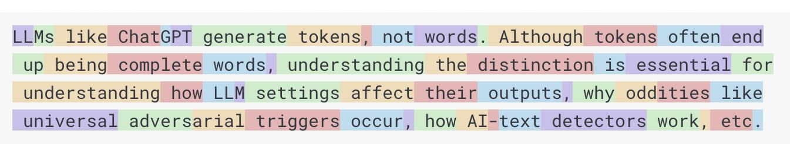

1. 大模型介绍

AI模型是旨在处理和生成信息的算法，通常模仿人类的认知功能。通过从大兴数据集中学习模式和见解，这些模型可以做出预测、文本、图像和其他形式输出，从而增强各个行业的各种应用。

Spring AI 是一个面向人工智能工程的应用框架，解决了 AI 集成的基本挑战：将企业数据和 API 与 AI 大模型连接起来。

2. 模型的分类：

AI模型根据数据类型，大致可以分为很多种，每种都适用于特定的用例。SpringAI目前支持：语言、图像和音频形式处理输入和输出的模型。

Embedding Model 通常接受文本作为输入并输出数字，通常称为嵌入文本（Embedding Text），用来表示AI模型中使用的内部数据结构。SpringAI提供了对Embedding的支持以支持开发更高级的应用场景。

3. SpringAI 核心概念

3.1 Prompt 提示词
Prompt作为语言基础输入的基础，知道AI模型生成特定的输出。
ChatGPT的API包含多个文本输入，每个文本输入都有其角色。
系统角色：用于告知模型如何行为并设定交互的背景。
用户角色：通常是来自用户的输入。
3.2 Prompt Template 提示词模版
创建有效的Prompt设计建立请求的上下文，并用用户输入的特定值替换请求的部分内容。这个过程使用传统的基于文本的模版引擎来进行Prompt的创建和管理。SpringAI采用开源库StringTemplate来实现这一目的。
3.3 Embedding 嵌入
嵌入（Embedding）是文本、图像或视频的数值表示，能够捕捉输入之间的关系，Embedding通过将文本、图像和视频转换为称为向量(Vector)的浮点数数组来工作。这些向量旨在捕捉文本、图像和音视频的含义，Embedding数组的长度称为向量的维度。

通过计算两个文本片段的向量表示之间的数值举例，应用程序可以确定用于生成嵌入向量的对象之间的相似性。

3.4 Token
token是AI模型工作原理的基石。输入时，模型将单词转换为 token。输出时，将token转换成单词。
在英语中，一个token大约对应一个单词的75%。
在托管AI模型的背景下，费用由使用的token数量决定，输入和输出都会影响总token数量。
模型还受到token限制，这会限制单个API调用中处理的文本量。此阈值通常称为“上下文窗口”。模型不会处理超出此限制的任何文本。

3.5 Structured Output 结构化输出
设计创建Prompt以产生预期的输出，然后将生成的简单字符串转换为可用于应用程序集成的数据结构。

3.6 将专有数据和API引入模型

3.6.1 Fine Tuning 微调
定制模型并修改模型内部权重，将内部数据和API引入模型

3.6.2 Prompt Stuffing 提示词填充

将数据嵌入到提供给模型的提示词中，将内部数据和API引入模型

3.7 RAG 检索增强生成
旨在解决为AI模型提供额外的知识输入，以辅助模型更好的回答问题。
先对数据进行 ETL处理（extract、transformer、load），入向量库、LLM处理

3.8 Function Calling 函数调用
大模型语言模型，是基于已有数据训练的，这就导致无法感知实时数据。

Function Calling解决了这个问题，它允许我们注册自己的函数，将LLM链接到外部系统的API，这些系统可以为LLM提供实时数据并代表他们执行数据处理操作。

步骤解释：
- （1）执行聊天请求并发送函数定义信息。后者提供name（description例如，解释模型何时应调用该函数）和input parameters（例如，函数的输入参数模式）。
- （2）当模型决定调用该函数时，它将使用输入参数调用该函数，并将输出返回给模型。
- （3）Spring AI 为您处理此对话。它将函数调用分派给适当的函数，并将结果返回给模型。
- （4）模型可以执行多个函数调用来检索所需的所有信息。
- （5）一旦获取了所有需要的信息，模型就会生成响应。

3.9 Evaluation 评估人工智能的回答
有效评估人工智能系统回答的正确性，对于确保最终应用程序的准确性和实用性非常重要。 Evaluation 评估过程设计分析响应是否符合用户的意图，与查询的上下文强相关，一些指标如相关性、连贯性和事实正确性等都被用于衡量AI生成的响应的质量。

